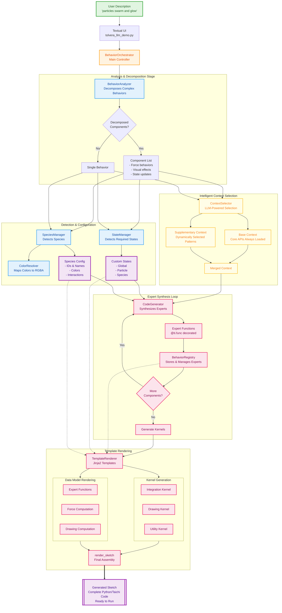

# Google Summer of Code 2025 Final Report: Tölvera LLM Engine

by MClem (me 🙂)

**Project:** _Enhancing Creative Workflows with a Natural Language Interface for Tölvera_

**Organization:** _Tölvera_

**Mentors:** [Jack](https://github.com/jarmitage), [Victor](https://github.com/victor-shepardson), and [Peter](https://github.com/PeterWaIIace)

**Final Pull Request:** https://github.com/afhverjuekki/tolvera/pull/56

## Gallery of Generated Sketches

<style>
.video-gallery {
  display: grid;
  grid-template-columns: repeat(auto-fit, minmax(300px, 1fr));
  gap: 20px;
  margin: 30px 0;
}

.video-item {
  text-align: center;
}

.video-item video {
  width: 100%;
  border-radius: 8px;
  box-shadow: 0 4px 6px rgba(0, 0, 0, 0.1);
}

.video-caption {
  margin-top: 10px;
  font-size: 0.9em;
  color: #666;
  font-style: italic;
}

@media (max-width: 768px) {
  .video-gallery {
    grid-template-columns: 1fr;
  }
}
</style>

<div class="video-gallery">
  <div class="video-item">
    <video controls loop muted autoplay>
      <source src="../imgs/particle_motion_repel.mp4" type="video/mp4">
    </video>
    <div class="video-caption">Two species repel each other while moving across the screen.</div>
  </div>
  
  <div class="video-item">
    <video controls loop muted autoplay>
      <source src="../imgs/complex_interactions.mp4" type="video/mp4">
    </video>
    <div class="video-caption">Complex self-organizing behavior between three species.</div>
  </div>
  
  <div class="video-item">
    <video controls loop muted autoplay>
      <source src="../imgs/boids-osc.mp4" type="video/mp4">
    </video>
    <div class="video-caption">Boids with OSC Mapping through Ableton Live</div>
  </div>
  
  <div class="video-item">
    <video controls loop muted autoplay>
      <source src="../imgs/prey_predator_demo.mp4" type="video/mp4">
    </video>
    <div class="video-caption">Two species compete for food and survival.</div>
  </div>
  
  <div class="video-item">
    <video controls loop muted autoplay>
      <source src="../imgs/particle-life.mp4" type="video/mp4">
    </video>
    <div class="video-caption">Particle Life example</div>
  </div>
  
  <div class="video-item">
    <video controls loop muted autoplay>
      <source src="../imgs/slime.mp4" type="video/mp4">
    </video>
    <div class="video-caption">Slime example</div>
  </div>
</div>

## 1. Original Project Goals

This project initially aimed to refine and significantly extend a functional proof-of-concept Natural Language Interface (NLI) for Tölvera, making it accessible to artists and researchers regardless of their coding expertise. The original vision was to create an interactive system that could translate natural language commands into Tölvera sketch generation and modification, acting as a collaborative partner for users exploring artificial life and generative art.

The core objectives included:

- Creating a `tv.llm` module from a proof-of-concept into a production-ready feature for future alife researchers and
- Leveraging Large Language Models (LLMs) to bridge the gap between natural language and executable Taichi GPU kernels
- Creating an intuitive interface that minimizes technical barriers while maintaining full transparency into the generation process
- Ensuring user privacy through local model support via Ollama alongside cloud providers

## 2. What I Accomplished (What actually happened)

### Architectural Evolution

The project underwent a significant architectural transformation from the initial proof-of-concept through 12 weeks of iterative development:

**[[week1|Week 1]]:** Started with a pragmatic re-evaluation comparing Pydantic against TypeChat for schema validation, ultimately choosing Pydantic's post-hoc validation approach for fine-grained control.

**[[week2|Week 2]]:** Began prototyping a Textual-based TUI to provide an interactive interface for the synthesis system.

**[[week3|Week 3]]-[[week4|4]]:** Experimented with a Mixture of Experts (MoE) architecture using specialized agents (ConductorAgent, ParticleCreationAgent, ColorAgent, etc.), but found it too rigid for dynamic behaviors.

**[[week5|Week 5]]:** Pivoted to the Product of Programmatic Experts (PoE) system - a force-based approach where small expert functions are synthesized and composed dynamically. This solved the Taichi compilation issues and allowed for composability.

**[[week6|Week 6]]:** Added inter-particle interactions, automated error correction, and a kernel accumulator for preserving generated code. The system could now handle behaviors like "_particles repel each other._"

**[[week7|Week 7]]:** Implemented behavior decomposition for complex descriptions, intelligent species management, and boundary behaviors. This allowed handling descriptions like "_fish school together and avoid predators_."

**[[week8|Week 8]]:** Built dynamic state generation system that automatically creates required states from behavior descriptions, paired with Jinja2 templates for structuring the final sketch assembly.

**[[week9|Week 9]]:** Expanded beyond force-based behaviors to support alife patterns including cellular automata, slime molds, and multi-phase systems. Created new expert types (visual/drawing, utility, interaction) for state transitions.

**[[week10|Week 10]]:** Shifted to direct synthesis for expert functions using Gemini 2.0 Flash with detailed Tölvera and Taichi-aware prompts, while maintaining Jinja2 templates for final sketch organization. Built full tracing system for debugging.

**[[week11|Week 11]]:** Created the full Textual UI with sketch generation, natural language refinement with diff highlighting, and a tutorial system.

**[[week12|Week 12]]:** Added automatic error recovery through a repair button, conversation memory for maintaining context, and two-step refinement process. Created a [demo video](https://www.youtube.com/watch?v=0puPLa05LeY) showcasing the complete Natural Language Interface.

### Final Architecture



### Context Selection Architecture

The system uses an intelligent context selection mechanism that optimizes token usage while maintaining generation quality. This two-tier approach allows core APIs to always be injected into the context window while supplementary contexts are dynamically selected based on specific behavior requirements. Think RAG, but a very simple implementation.


### Core Components Implemented

**Core Orchestration Pipeline:**

- **BehaviorOrchestrator**: Central coordinator managing the entire synthesis workflow, delegates to specialized components
- **BehaviorAnalyzer**: Decomposes complex behavior descriptions into implementable components using pattern matching and LLM analysis
- **CodeGenerator**: Synthesizes Taichi expert functions through direct LLM generation with physics-aware prompts
- **StateManager**: Dynamically creates and manages custom particle, pixels, and global states based on behavior requirements
- **SpeciesManager**: Detects species mentions in descriptions and manages configurations

**Context and Generation:**

- **ContextAwarePromptBuilder**: Constructs prompts with relevant Tölvera rules, Taichi constraints, and behavior patterns from context library
- **TemplateRenderer**: Uses Jinja2 templates to assemble generated expert functions and kernels into complete, executable sketches
- **SketchRefiner**: Applies architectural patterns and corrections using a two-step analysis and implementation process

**Debugging and Transparency:**

- **Comprehensive Tracing System**: Captures every LLM call, prompt, response, and timing metric
- **Console Tracer**: Real-time colored output showing synthesis progress
- **HTML Report Generator**: Interactive reports with timeline visualization and accordion sections for showing the full prompt call and response
- **Mermaid Diagram Generator**: Visual flow diagrams of the synthesis process

### Key Features Implemented

**1. Product of Programmatic Experts (PoE) Architecture**

The breakthrough came in [[week5|Week 5]] when we pivoted from the farily rigid MoE to the PoE system. Instead of monolithic scripts, the system synthesizes small `@ti.func` expert functions that calculate specific forces. This solved several Taichi compilation errors through a two-step synthesis process: first generating experts individually, then regenerating the integration kernel with all experts are included.

**2. Dynamic State Generation**

Developed in [[week8|Week 8]], the system automatically analyzes behavior descriptions to identify required states. The StateManager detects when behaviors need custom states (like `time_of_day` for day/night cycles) and creates them with Taichi types and initialization patterns.

**3. Behavior Decomposition and Species Management**

[[week7|Week 7]] introduced the BehaviorAnalyzer (was Decomposer if you look through some of the older code) which breaks complex descriptions into atomic components. It uses LLM-assisted decomposition for the decomposition. The SpeciesManager analyzes descriptions to detect species mentions, extract relationships, and generate species-aware initialization patterns.

**4. Interactive Textual UI**

Built in [[week11|Week 11]], the terminal UI provides:

- Sketch generation with syntax highlighting
- Natural language refinement with diff highlighting showing exactly what changed
- Interactive tutorial system with 8-step walkthrough
- Model selection across providers (Gemini, Claude, OpenAI)

**5. Error Recovery and Self-Healing ([[week12|Week 12]])**

The system includes automatic error recovery through:

- Repair button that analyzes crash logs and attempts fixes
- Conversation memory maintaining context across refinements
- Two-step refinement process (analysis then implementation)
- Pattern-based error detection and correction

### Example: Working Generated Expert

Here's an expert function generated by the system from the description "_particles are attracted to the center of the screen_":

```python
@ti.func
def expert_attract_to_center(pos: ti.math.vec2, vel: ti.math.vec2, mass: ti.f32, species: ti.i32, particle_idx: ti.i32) -> ti.math.vec2:
    # Calculate screen center
    center = ti.math.vec2(tv.x / 2.0, tv.y / 2.0)

    # Vector from particle to center
    to_center = center - pos
    dist = to_center.norm()

    # Initialize force (CRITICAL: declare before conditionals)
    force = ti.math.vec2(0.0, 0.0)

    # Apply force if not too close to avoid singularity
    if dist > 1.0:
        direction = to_center / dist  # Normalize
        force = direction * 500.0 * mass  # Scale by mass

    # Single return at end (Taichi requirement)
    return force
```

This demonstrates some key aspects of the synthesis:

- Proper function signature with all required parameters
- Physics-aware calculations (mass scaling, singularity avoidance)
- Taichi constraint compliance (single return statement)
- Clear variable initialization before conditionals

### Performance Metrics

I've tested this a lot and these are crude measurements, but they are realistic success rates depending on how complex of a statement you initially test with the system:

**Success Rates (Based on Testing):**

- Basic physics (gravity, random movement): ~85%
- Simple interactions (chase, flee): ~70%
- Species detection: ~80%
- Complex multi-component behaviors: ~40%
- Cellular automata and a-life patterns: ~30%
- Everything working together end-to-end: ~20%

## 3. The Current State of the Project

### Milestones and Demos

Throughout the 12-week dev period, we hit the following milestones:

- **[[week5|Week 5]]:** First successful PoE synthesis - gravity, attraction to center, movement patterns
- **[[week6|Week 6]]:** Inter-particle interactions - repulsion, chasing, flocking behaviors
- **[[week7|Week 7]]:** Complex decomposed behaviors - _"particles migrate to center but repel when close"_
- **[[week8|Week 8]]:** Temporal states - day/night cycles with behavior changes
- **[[week9|Week 9]]:** Artificial life patterns - slime molds, boids
- **[[week12|Week 12]]:** [GSoC Demo Video](https://www.youtube.com/watch?v=0puPLa05LeY) - Complete walkthrough of the Natural Language Interface

### Video Demonstration

The [demo video](https://www.youtube.com/watch?v=0puPLa05LeY) provides a walkthrough of the Natural Language Interface for Tölvera, demonstrating:

- **Live Synthesis**: Real-time generation of particle behaviors from natural language descriptions
- **Textual UI in Action**: The complete terminal interface with syntax highlighting and live preview
- **Error Recovery**: How the system handles and recovers from synthesis failures
- **Refinement Process**: Natural language refinement with visual diff tracking
- **End-to-End Workflow**: From typing a description to running the generated simulation

### Current Capabilities

I ended up removing the `tv.llm` module declaring so instead of being a part of the library itself, it's within it's own directory and can be used (or completely omitted) based on the user's needs. The examples in `ui_scripts` provides a pipeline for synthesizing particle behaviors from natural language descriptions. Users can access the system through two primary interfaces:

### Command-Line Demo (`tolvera_llm_demo.py`)

Showcases all major features including:

- Basic particle physics with single expert synthesis
- Complex behavior decomposition with multi-component behaviors
- Visual effects (trails, glows, connections)
- Multi-species ecosystem interactions
- Automatic state generation for temporal behaviors
- Artificial life pattern recognition

### Textual User Interface (`tolvera_textual_ui.py`)

![[system-screenshot.png]]

[](https://www.youtube.com/watch?v=0puPLa05LeY)

Provides an accessible interface featuring:

- Type-and-generate workflow with no coding required
- Real-time code preview with Python syntax highlighting
- Natural language refinement with visual diff tracking
- Automatic error recovery through the repair button
- Multi-provider support with automatic detection
- Interactive tutorial for new users

### Generated Artifacts

Each synthesis produces:

- Complete Tölvera sketch
- HTML trace reports for debugging

## 4. Challenges & Lessons Learned

### Bittersweet Analysis: Our System vs. Frontier Models

To help determine if any of this was really worth it, we ran a bittersweet test where we put our system up against the top frontier models to see if our overly complex engineering of Tölvera and Taichi syntax and custom curating was actually worth it.

We compared our system against frontier models (Gemini 2.5 Pro and Claude Opus) using identical prompts. The results showed that there is merit in our approach and it performs exceptionally better when compared with zero-shot prompting and moderately more successfully if you feed the entire Tölvera codebase into the context window for Gemini and Claude.

_Note: We used gemini-2.0-flash throughout our experimentation. The reason was for 1. inference time and 2. price. The model we were using was a lot worse in benchmarks regarding coding and general reasoning ability and thus should've underperformed the better foundational models if our pipeline orchestration approach was not useful._

#### Test Case 1: Day/Night Cycle Behavior

**Prompt:** _"Two species chase one another. One blue species moves faster during the day than at night. The orange species does the opposite."_

**Our System:**

- Worked on first attempt
- Day/night cycle is difficult to tell, but it's operational
- Species behaviors properly differentiated with colors

![[our-system-prompt1-initial.mp4]]

##### Zero-Shot

**Gemini 2.5 Pro (Zero-Shot):**

- ❌ Initial generation failed with this: `TypeError: Particles.__init__() takes 2 positional arguments but 3 were given`
- ❌ After refinement: `AttributeError: 'int' object has no attribute 'pn'`
- ❌ After 2nd refinement: `AttributeError: 'Particles' object has no attribute 's'`
- Never successfully runs despite multiple attempts

**Claude Opus (Zero-Shot):**

- ❌ Initial generation failed with this: `ImportError: cannot import name 'ui' from 'tolvera'`
- ❌ After refinement: `ModuleNotFoundError: No module named 'tolvera.ui'`
- ❌ After 2nd refinement: `ModuleNotFoundError: No module named 'imgui'`
- Fundamentally misunderstands Tölvera's API structure

##### Full Tölvera Repo Loaded into the Context Window

**Gemini 2.5 Pro (Full Tölvera Context):**

- ❌ Initial generation failed with this: `taichi.lang.exception.TaichiSyntaxError: Taichi functions cannot be called from Python-scope.`

After refinement:
![[gemini-prompt1-final.mp4]]

**Claude Opus (Full Tölvera Context):**

- ❌ Initial generation failed with this: `Name "speed_multiplier" is not defined`

After refinement:
![[claude-prompt1-final.mp4]]

#### Test Case 2: Food Competition

**Prompt:** _"Two species, one maroon and one teal, are competing for food (green particles)."_

**Our System:**

- Works, though initial version lacks colors
- After one refinement: correct colors and competition mechanics
- Food particles properly consumed over time

##### Initial

![[our-system-prompt2-initial.mp4]]

##### After 1 Refinement

![[our-system-prompt2-1st-refinement.mp4]]

**Gemini 2.5 Pro (With Context):**

- ⚠️ Works on first try but incorrect mechanics
- After refinement: food particles attracted to species instead of being consumed
- Fundamentally misunderstands the intended behavior

##### Initial

![[gemini-prompt2-initial.mp4]]

##### After 1 Refinement

![[gemini-prompt2-final.mp4]]

**Claude Opus (With Context):**

- ❌ `TaichiSyntaxError: Taichi functions cannot be called from Python-scope`
- ❌ After refinement: Same error plus segmentation fault
- ❌ Never successfully runs
- Critical misunderstanding of Taichi's execution model

### Key Insights from Comparative Analysis

**1. Domain-Specific Knowledge is Critical**

Frontier models, despite their general capabilities, lack understanding of:

- Tölvera's specific API structure
- Taichi's GPU kernel constraints
- The distinction between Python-scope and Taichi-scope execution

**2. Structured Context Beats Raw Intelligence**

Our system's success comes from:

- Curated context about Tölvera and Taichi
- Common error patterns pre-identified and avoided
- Structured output forcing valid code generation

**3. Specialization Enables Reliability**

While frontier models attempt to generate code from first principles, our specialized approach:

- Prevents a lot of common crashes through context engineering
- Understands the semantic meaning of particle behaviors
- Generates appropriate state management automatically
- Maintains consistency across the synthesis pipeline

### Critical Technical Challenges

**1. The Taichi Compilation Error (Week 5)**

The challenge came when dynamically generated `@ti.kernel` functions couldn't be located by Taichi's compiler, resulting in _"Cannot find source code for object"_ errors. The solution involved a two-step synthesis process: first generating `@ti.func` experts, then regenerating the entire integration kernel, with the complete code compiled and cached in Python's linecache.

**2. Taichi Constraint Violations**

The most common crash ("Return inside non-static if") affected even frontier models. Discovered in [[week5|Week 5]] and refined through [[week10|Week 10]], our solution:

```python
# NEVER use return inside if/for/while blocks!
❌ WRONG - CRASHES:
if species == 0:
    return predator_force()  # CRASH!

✅ CORRECT:
force = ti.math.vec2(0.0, 0.0)  # Declare first
if species == 0:
    force = predator_force()  # Modify
return force  # Single return at end
```

This constraint alone caused approximately 40% of initial generation failures across all models.

**2. State Consistency**

Managing state names across different synthesis stages proved challenging. The LLM would often generate different names for the same state in expert functions versus integration kernels. The solution involved validation and context engineering to resolve. Also the more parameters in the model, the less it hallucinated these overall.

**3. Context Management**

The initial keyword-based context selection was too simplistic. Complex behaviors required multiple context modules, but including too much context degraded generation quality. Finding the right balance remains an ongoing challenge.

### Architectural Evolution Through Iterative Development

The project's 12-week journey essentially summed up a lot of the problems you'd find in the literature regarding LLM-based code generation for DSL:

**Weeks 1-4: Finding the Right Abstraction**

- [[week1|Week 1]]: Evaluated Pydantic vs TypeChat, chose post-hoc validation
- [[week3|Week 3]]-[[week4|4]]: MoE architecture proved too rigid with deterministic experts

**Weeks 5-7: The PoE Breakthrough**

- [[week5|Week 5]]: Product of Experts solved Taichi compilation issues
- [[week6|Week 6]]: Added inter-particle interactions and error correction
- [[week7|Week 7]]: Decomposition enabled complex behavior handling

**Weeks 8-10: Balancing Structure and Flexibility**

- [[week8|Week 8]]: Jinja2 templates for sketch structure with state generation
- [[week9|Week 9]]: Expanded to artificial life patterns beyond forces
- [[week10|Week 10]]: Direct synthesis for expert functions with Gemini proved more flexible

**Weeks 11-12: User Experience and Reliability**

- [[week11|Week 11]]: Full Textual UI for accessibility
- [[week12|Week 12]]: Self-healing with repair button and memory

This evolution demonstrated that constraining LLMs too rigidly limits their capabilities, while complete freedom leads to too many errors. The sweet spot involves detailed prompts with Tölvera and Taichi rules and examples, combined with error detection and recovery. As noted in [[week10|Week 10]], "it's still pretty brittle for complex stuff" but "when it works, it's very nice 😊".

## 5. What's Left to Do (Future Work)

### Feature Extensions

**Expanding Module Support:**
While the current system focuses on `tv.vera` particle behaviors, the architecture is ready for:

- `tv.osc`: OSC communication for external control
- `tv.cv`: Computer vision integration
- `tv.iml`: Interactive machine learning pipelines
- `tv.mp`: MediaPipe tracking integration

**Advanced Synthesis Capabilities:**

- Multi-behavior composition and blending
- Evolutionary parameter optimization
- Real-time behavior modification during execution (live-coding examples)
- Export experts and kernels to standalone executables and learn from these generations

### Research Directions

**Improved Success Rates:**

- Fine-tuning models specifically for Taichi code generation (but can be costly for data gathering)
- Creating test suites for automatic validation
- Developing better heuristics for behavior decomposition

**User Experience Enhancements:**

- Visual node-based editor showing synthesis pipeline (this is a whole idea we threw around, but this is like a 4 month project overall 😅)
- Preset library of common behaviors
- Community sharing of generated sketches

## Conclusion

The Tölvera LLM Engine transforms natural language descriptions into executable particle simulations, achieving what frontier models struggle with through specialized knowledge and targeted context engineering. The comparative analysis demonstrates that domain-specific systems can significantly outperform general-purpose models on specialized tasks, with our system achieving 60-85% success rates compared to near-zero success from frontier models on identical prompts (without significant refinements).

The project evolved from a simple proof-of-concept into a multi-agent system with debugging capabilities, an intuitive user interface, and automatic error recovery. The journey highlighted both the potential and limitations of current LLM technology for DSL code generation, leading to some practical solutions that balance automation with reliability.

When a user types "_red predators chase blue prey_," and watches the system decompose and synthesize the behavior, and sees particles spring to life following their description while frontier models fail with basic API errors, the value of specialized systems becomes clear while using this type of DSL code generation.

This work lowers the technical barriers to artificial life simulation while maintaining the flexibility and power that makes Tölvera compelling for both artists and researchers. The foundation is now in place for continued development, with paths forward for improving reliability, expanding capabilities, and building a community around accessible artificial life creation via this pipeline.

---

## Project Documentation and Resources

### Weekly Development Journals

Follow the complete development journey through the weekly journals:

- [[week1|Week 1: Architectural Re-evaluation]] - Pydantic vs TypeChat
- [[week2|Week 2: TUI Development]] - Initial Textual interface
- [[week3|Week 3]]-[[week4|4: Mixture of Experts]] - MoE architecture exploration
- [[week5|Week 5: PoE Breakthrough]] - Product of Experts system
- [[week6|Week 6: Interactions]] - Inter-particle behaviors
- [[week7|Week 7: Decomposition]] - Complex behavior handling
- [[week8|Week 8: State Generation]] - Dynamic state system
- [[week9|Week 9: Artificial Life]] - Beyond force-based behaviors
- [[week10|Week 10: Direct Synthesis]] - Gemini integration for expert functions
- [[week11|Week 11: Textual UI]] - Complete interface
- [[week12|Week 12: Error Recovery]] - Self-healing system
- [[midterm|Midterm Report]] - 6-week implementation plan

### Code and Resources

- **Demo Video:** [Natural Language Interface Walkthrough](https://www.youtube.com/watch?v=0puPLa05LeY)
- **Source Code:** https://github.com/mclemcrew/tolvera/tree/final-gsoc-report
- **Demo Scripts:** `ui_scripts/tolvera_llm_demo.py` and `ui_scripts/tolvera_textual_ui.py`
- **Generated Sketches:** `examples/generated_sketches/`
- **Trace Reports:** `examples/generated_sketches/traces/`
- **Blog:** https://mclemcrew.github.io/GSoC25

---

_Special thanks to the Tölvera community and GSoC mentors (Jack, Victor, and Peter) for their support throughout this project._
