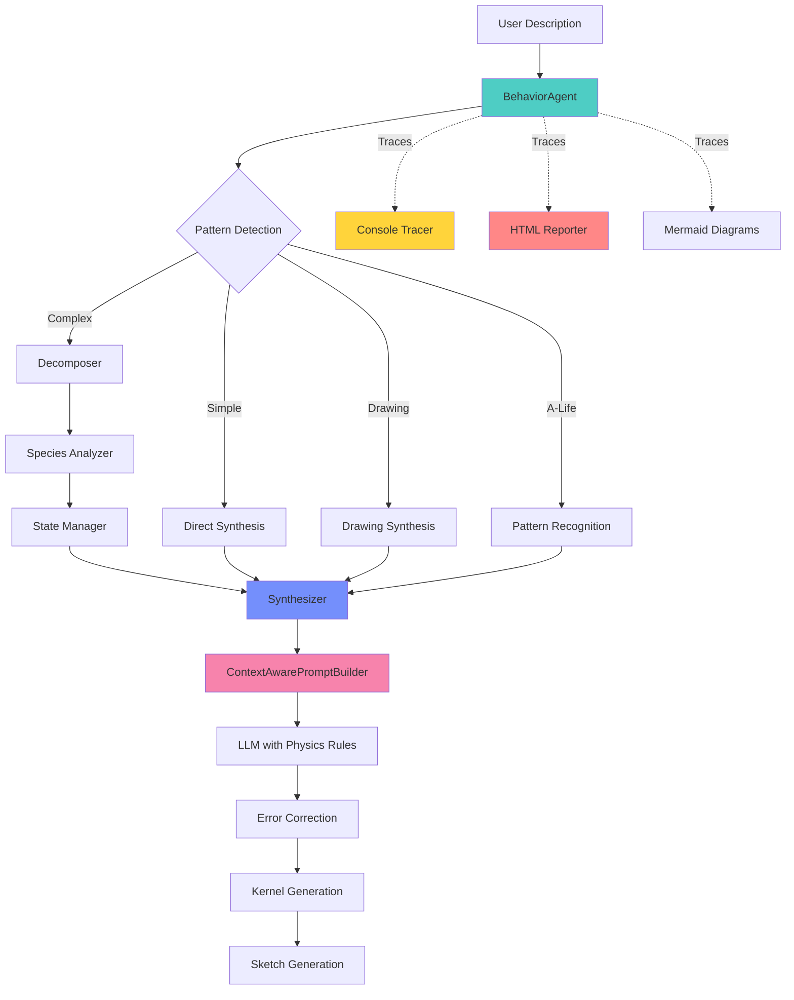

# Week 10: Ditching Templates for Direct Synthesis

## Executive Summary

Week 10 was about ditching the template approach entirely and rebuilding around direct synthesis with Gemini. Instead of trying to constrain LLMs with rigid structures, we just give the model really detailed prompts with Taichi and Tölvera constraints baked in.

I also built out a better tracing system that logs everything - every prompt, response, timing, token usage. It generates HTML reports so you can see exactly what went wrong when things break. And they still break pretty often, especially for complex multi-species stuff.

The system works well for basic particle physics (gravity, random movement, simple chase/flee). It's hit-or-miss for complex behaviors like cellular automata or sophisticated flocking. But when it works, it's very nice 😊

## What Actually Changed

### 1. **Direct Synthesis**

I completely abandoned the Jinja2 template approach from [Week 8](week8.md). The templates were just too rigid and broke whenever you asked for anything interesting. Instead:

- Switched to **Gemini 2.0 Flash** as the main model (fast, handles structured and constrained outputs well)
- Generate Taichi code directly through Pydantic models
- Let the LLM figure out the complexity instead of constraining it
- Put all the effort into really detailed prompt engineering

### 2. **The New Architecture**



### 3. **Prompt Engineering**

Think more context engineering on this one. Just have to provide the right example to the right call to the LLM at the right time.

#### **ContextAwarePromptBuilder** (`core/prompts.py`)

This is probably the most important part. It builds prompts with:

1. **Physics Conventions**:

```python
# PHYSICS CONVENTIONS (CRITICAL):
- Coordinate system: STANDARD MATHEMATICAL/PHYSICS CONVENTION
  - Origin (0,0) is at TOP-LEFT corner of screen
  - X increases to the RIGHT (positive X = rightward)
  - Y increases UPWARD (positive Y = upward)
- Gravity: Since Y+ points up, gravity force must be NEGATIVE Y
  - Correct: return ti.math.vec2(0.0, -gravity_strength * mass)
  - Wrong: return ti.math.vec2(0.0, gravity_strength * mass)  # Makes particles fly up!
```

1. **Force Balancing Guidelines**:

```python
Force magnitudes for emergent behaviors:
- Gravity: 300-800 (negative Y)
- Chase/Hunt: 400-600
- Flee/Escape: 300-500
- Flocking alignment: 50-200
- Random movement: 20-100
```

1. **Taichi Rules** (THE #1 CAUSE OF CRASHES):

```python
# NEVER use return inside if/for/while blocks!
❌ WRONG - CRASHES:
if species == 0:
    return predator_force()  # CRASH!

✅ CORRECT:
force = ti.math.vec2(0.0, 0.0)  # Declare first
if species == 0:
    force = predator_force()  # Modify
return force  # Single return at end
```

4. **Context Detection**:
   The system includes only relevant context based on the description (this isn't great at this point):

```python
def _detect_relevant_contexts(self, description: str) -> List[str]:
    if 'flock' in description:
        contexts.extend(['flocking', 'vera_patterns'])
    if 'cellular' in description:
        contexts.extend(['cellular', 'temporal'])
    if 'trail' in description:
        contexts.extend(['pixels_api', 'vera_patterns'])
```

### 4. **Core Components**

#### **BehaviorAgent** (`core/behavior_agent.py`)

This is the main coordinator that tries to:

- Analyze what you want upfront and create states before synthesis (prevents conflicts)
- Pass context between components so they work together
- Track helper functions so they can be reused
- Merge species configs when you add multiple behaviors
- Generate update kernels for time-based stuff

The key method is `synthesize_complete_behavior`:

```python
async def synthesize_complete_behavior(self, description: str, weight: float = 1.0):
    # 1. Decompose if needed
    decomposed = await self.decomposer.decompose(description)

    # 2. Analyze requirements with decomposition info
    self.current_behavior_requirements = self.requirements_analyzer.analyze(description, decomposed)

    # 3. Create ALL states upfront (avoids conflicts)
    self.state_manager.collect_and_create_states(all_states_specs)

    # 4. Build shared context for synthesis
    shared_context = {
        "behavior_requirements": self.current_behavior_requirements,
        "available_states": self.state_manager.get_available_states(),
        "pattern_type": self.current_behavior_requirements.pattern_type,
        "shared_parameters": self.current_behavior_requirements.shared_parameters,
        "constraints": self.current_behavior_requirements.constraints,
        "states_already_created": True
    }

    # 5. Synthesize each component with shared context
    for component in decomposed.components:
        await self._synthesize_component_with_context(component, weight, shared_context)
```

#### **Decomposer** (`core/decomposer.py`)

Uses pydantic-ai to break complex behaviors into parts:

- Has predefined behavior patterns (fluttering, swarming, hunting, etc.)
- Tries to add visual embellishments
- Passes context between components (when it works)
- Detects species mentioned in descriptions

The system prompt is the following:

```python
system_prompt="""You are an expert at analyzing behavior descriptions and ALWAYS generating
the required expert components. You MUST create components for every behavior.

TÖLVERA CONTEXT:
- Particles have built-in properties: pos, vel, mass, size, species, active
- Coordinate system: (0,0) is top-left, Y+ points upward
- Forces should return ti.math.vec2(x, y) values
- CRITICAL: Never use 'return' inside if/for/while blocks

Your role is to:
1. ANALYZE SPECIES: Determine how many species are mentioned
2. Assess if behavior is SIMPLE (one expert) or COMPLEX (multiple)
3. For each expert, provide high-level specifications
4. For complex behaviors, establish shared context
5. ALWAYS generate appropriate initialization and temporal components
"""
```

#### **StateManager** (`core/state_manager.py`)

Handles creating custom states:

- Tries to map state names to Taichi types automatically
- Different initialization strategies for different types
- Manages the `llm_global`, `llm_particle`, `llm_species` containers
- Generates both the container and initialization code

Attempts intelligent state initialization:

```python
def _init_particle_states(self, state_obj, states: Dict[str, Any]):
    for prop_name, prop_def in states.items():
        if 'home' in prop_name.lower() and 'vec2' in type_str:
            # Initialize home position to current position
            setattr(state_obj.field[i], prop_name, ti.math.vec2(pos[0], pos[1]))
        elif 'energy' in prop_name.lower():
            # Start with high energy
            initial_val = min_val + (max_val - min_val) * 0.8
```

#### **Context Library** (`context/`)

A collection of patterns and examples:

- **library_docs.py**: Tölvera API, Taichi essentials, state access patterns
- **patterns.py**: Movement, flocking, interaction, temporal, cellular automata
- **vera_patterns.py**: Tölvera-specific patterns and interactions
- **drawing_patterns.py**: Visual effects and drawing APIs
- **alife_patterns.py**: Evolution, ecosystems, morphogenesis, swarm intelligence
- **examples.py**: Expert function examples (the ones that actually work)

### 5. **The Tracing System**

#### **Console Tracer** (`debug/console_tracer.py`)

Real-time colored output that shows what's happening:

```
⏳ Basic Behaviors Demo
├─ ⏳ Decomposing: decompose_behavior
│  ├─ 🤖 Decomposition LLM Call (gemini-2.0-flash)
│  ├─   [2.8s] → 3 components
│  ├─ Interpretation: "Two species affected by gravity"
│  ├─ Complexity: Complex (3 experts)
│  ├─ Components:
│  ├─   • gravity_force [force] (0.8)
│  ├─     Apply downward force proportional to mass
│  ├─     → Apply a force in the Y+ direction proportional to...
│  ├─   • random_drift [force] (0.5)
│  ├─     Apply random forces for wandering motion
│  ├─     → Apply small random forces in both X and Y directions...
```

#### **HTML Reporter** (`debug/trace_html_report.py`)

Generates interactive reports:

- Timeline visualization with color-coded phases
- Collapsible sections for prompts, responses, parsed JSON
- Mermaid diagrams (when they render correctly)
- Token usage metrics
- Shows every prompt and response (useful for debugging)

### 6. **The Synthesis Pipeline in Detail**

When you run `await agent.add_behavior("red sharks hunt blue fish")`:

1. **Decomposition with Species Detection**:

```python
# Decomposer analyzes and outputs:
DecomposedBehavior(
    interpretation="Red sharks hunting blue fish in an ecosystem",
    is_simple=False,
    components=[
        BehaviorComponent(expert_name="shark_hunt", expert_type="force", ...),
        BehaviorComponent(expert_name="fish_flee", expert_type="force", ...),
        BehaviorComponent(expert_name="species_initialization", expert_type="initialization", ...)
    ],
    species_info=SpeciesInfo(
        total_count=2,
        species_names={0: "shark", 1: "fish"},
        species_colors={0: [1.0, 0.2, 0.2, 1.0], 1: [0.2, 0.2, 1.0, 1.0]}
    )
)
```

2. **Requirements Analysis**:

```python
BehaviorRequirements(
    pattern_type="ecosystem",
    pattern_confidence=0.95,
    state_requirements=[],  # No custom states needed
    shared_parameters={"detection_radius": 200.0, "chase_speed": 500.0},
    constraints=["prey_speed < predator_speed"],
    temporal=False,
    pixel_field=None
)
```

3. **Context-Aware Prompt Building**:
   The ContextAwarePromptBuilder is probably the most important piece that makes any of this work.

When you say "red sharks hunt blue fish", it does some basic keyword matching:

- Sees "sharks" + "hunt" + "fish" → includes SPECIES_INTERACTION_PATTERNS and ECOSYSTEM_PATTERNS
- Multiple species mentioned → adds VERA_INTERACTIONS (multi-species examples)
- "hunt" behavior → throws in predator-prey templates
- Any behavior at all → always includes TÖLVERA_CORE_API and TAICHI_FUNDAMENTALS

I've built up about 15 different context modules over time:

- **TÖLVERA_CORE_API**: How to access `tv.p.field[i].pos`, particle properties, etc.
- **SPECIES_INTERACTION_PATTERNS**: Predator-prey code templates (when they work)
- **TAICHI_FUNDAMENTALS**: Vector math, force calculations, the critical "no returns in conditionals" rule
- **ECOSYSTEM_PATTERNS**: Ecological behaviors like hunting, fleeing, territorial stuff
- **FLOCKING_PATTERNS**: Boids, schooling, alignment behaviors
- **TEMPORAL_PATTERNS**: Day/night cycles, energy systems
- **And more**: cellular automata, drawing effects, slime molds, etc.

The selection logic is pretty basic - just keyword scanning:

```python
if 'flock' in description:
    contexts.extend(['flocking', 'vera_patterns'])
if 'cellular' in description:
    contexts.extend(['cellular', 'temporal'])
if 'trail' in description:
    contexts.extend(['pixels_api', 'vera_patterns'])
```

This works okay for simple stuff. Instead of sending 15 contexts, it picks maybe 3-5 relevant ones. Keeps token usage down and gives the LLM a better chance of getting it right. But it's still pretty fragile - if your description doesn't match the keywords exactly, it might miss important context and generate broken code.

1. **Expert Synthesis with Error Prevention**:

```python
@ti.func
def shark_hunt(pos: ti.math.vec2, vel: ti.math.vec2, mass: ti.f32, species: ti.i32, particle_idx: ti.i32) -> ti.math.vec2:
    # CRITICAL: Declare force FIRST (prevents crash)
    force = ti.math.vec2(0.0, 0.0)

    # Only sharks hunt (species 0)
    if species == 0:
        hunt_radius = 200.0
        nearest_prey = -1
        min_dist = hunt_radius

        # Find nearest prey
        for j in range(tv.pn):
            if tv.p.field[j].species == 1 and tv.p.field[j].active > 0:
                diff = tv.p.field[j].pos - pos
                dist = diff.norm()  # Works because diff is ti.math.vec2
                if dist < min_dist:
                    min_dist = dist
                    nearest_prey = j

        # Apply force if prey found
        if nearest_prey >= 0:
            prey_pos = tv.p.field[nearest_prey].pos
            to_prey = prey_pos - pos
            if to_prey.norm() > 0.001:
                direction = to_prey / to_prey.norm()  # Manual normalize
                force = direction * 500.0  # SET force, don't return!

    # SINGLE return at END
    return force
```

1. **Species-Aware Initialization**:

```python
# Clustered initialization for ecosystem
@ti.kernel
def init_particles_clustered():
    # Sharks cluster in one area
    shark_center = ti.Vector([tv.x * 0.3, tv.y * 0.5])
    # Fish cluster in another
    fish_center = ti.Vector([tv.x * 0.7, tv.y * 0.5])
    # ... initialization code
```

### 7. **Critical Implementation Details**

#### **The particle_idx Parameter**

One of the most common errors - using undefined 'i':

```python
❌ WRONG:
for j in range(tv.pn):
    if i != j:  # ERROR: 'i' not defined!

✅ CORRECT:
def expert(... particle_idx: ti.i32):
    for j in range(tv.pn):
        if particle_idx != j:  # Use the parameter!
```

#### **Vector Operations**

Careful handling of Taichi vector types:

```python
# For ti.math.vec2 (PREFERRED):
force = ti.math.vec2(0.0, 0.0)
dist = diff.norm()  # Works

# For ti.Vector (older):
vec = ti.Vector([x, y])
dist = ti.sqrt(vec[0]**2 + vec[1]**2)  # Manual
```

#### **Math Functions**

Always use Taichi versions:

```python
❌ import math; angle = math.sin(t)  # ERROR
✅ angle = ti.sin(t)  # Correct
```

### 8. **Temporal and State Management**

The system automatically generates temporal update kernels for complex behaviors:

```python
@ti.kernel
def update_temporal_states():
    frame = tv.ctx.i[None]
    fps = 60.0
    time = ti.cast(frame, ti.f32) / fps

    # Update grid states for cellular automata
    if has_grid_states:
        # Count neighbors
        for i in range(tv.pn):
            count = count_neighbors(i)
            tv.s.llm_particle.field[i].neighbor_count = count

        # Apply rules
        for i in range(tv.pn):
            alive = tv.s.llm_particle.field[i].is_alive
            neighbors = tv.s.llm_particle.field[i].neighbor_count
            next_state = apply_game_of_life_rules(alive, neighbors)
            tv.s.llm_particle.field[i].next_state = next_state

        # Commit changes
        for i in range(tv.pn):
            tv.s.llm_particle.field[i].is_alive = tv.s.llm_particle.field[i].next_state
```

### 9. **Generated Artifacts**

Each synthesis produces these outputs:

#### **Complete Python Sketch**

```python
#!/usr/bin/env python3
"""
Basic particle physics demo
Generated by Tölvera LLM System
"""

import taichi as ti
from tolvera import Tolvera, run

# Expert functions
@ti.func
def gravity_force(...):
    # Generated expert code

# Integration kernel
@ti.kernel
def apply_all_experts():
    # Generated integration

# Main function
def main(**kwargs):
    tv = Tolvera(**kwargs)

    # Initialize particles
    init_particles()

    # Render loop
    @tv.render
    def _():
        if hasattr(tv.s, 'llm_global'):
            update_temporal_states()
        apply_all_experts()
        return tv.px

if __name__ == '__main__':
    run(main)
```

#### **HTML Report**

Shows everything: timeline, LLM calls, prompts, responses, tokens, and diagrams.

### 10. **Performance & Reality Check**

Synthesis times with Gemini 2.0 Flash are decent:

- Simple behavior: ~2-3 seconds (usually works)
- Complex decomposition: ~5-8 seconds (hit-or-miss)
- State analysis: ~2-3 seconds (often wrong)
- Complete sketch generation: ~10-15 seconds total (if it works)
- Token usage: 2k-5k input, 1k-3k output per call

Success rates (roughly):

- Basic physics (gravity, random): ~85%
- Simple interactions (chase, flee): ~70%
- Species detection: ~60%
- Complex behaviors: ~40%
- Cellular automata: ~30%
- Everything working together: ~20%

The tracing system catches most failures, but you still end up debugging generated code fairly often.

## What Actually Works

### 1. **Physics-Aware Synthesis (Sometimes)**

When it works, the system gets basic physics right - gravity pulls down, forces mostly balance.

### 2. **Context Selection (Basic)**

It tries to include only relevant patterns. Works okay for simple keyword matching.

### 3. **Error Prevention (Partial Success)**

Encoding Taichi's constraints in prompts helps prevent some common crashes. Still breaks often.

### 4. **Full Transparency (Best Part)**

Every decision is traced, every prompt logged. Makes debugging much easier when things break.

## Conclusion

Week 10's progress comes from three main things:

1. **Better prompt engineering** that bakes in physics rules and Taichi constraints
2. **Holistic synthesis** approach with upfront state creation
3. **Comprehensive tracing** so you can debug when things go wrong

But it's still pretty brittle for complex stuff. Multi-species ecosystems are hit-or-miss. Cellular automata sometimes work, sometimes don't. Sophisticated flocking behaviors are inconsistent. The keyword-based context selection is too simplistic. This is the thing to fix next. We are soooo close with the new model choice. So we are heading in the right direction ✌️

The tracing system is probably the most valuable part - when synthesis fails (and it still does often), you can see exactly what went wrong. Which prompt was sent, what the LLM thought it was doing, where the generated code broke.

---

_Generated sketches in `examples/generated_sketches/`_  
_Trace reports in `examples/generated_sketches/traces/`_  
_Run the demo: `poetry run python examples/tolvera_llm_demo.py`_
