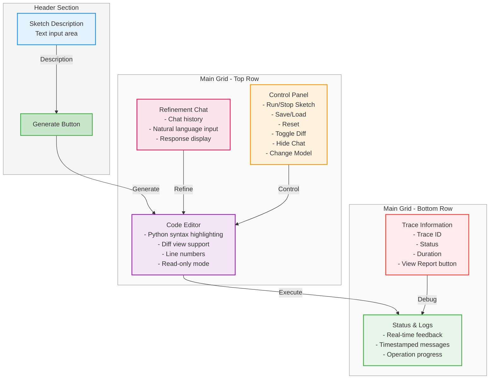

# Week 11: Building a Textual UI for Interactive Synthesis

## Executive Summary

Week 11 was about making the synthesis system actually usable by peeps who aren't me and working on this every week. Built a TUI using Textual (based off some things we learned all the way from [week2](week2.md)) that wraps all the LLM functionality in an interactive experience. The UI features real-time sketch generation, natural language refinement with diff highlighting, and an interactive tutorial. Everything happens through natural language, but with full transparency into what the system is doing through the tracer.

The code for this week can be seen [here](https://github.com/mclemcrew/tolvera/tree/week11) with the demo file: [examples/tolvera_textual_ui.py](https://github.com/mclemcrew/tolvera/blob/week11/examples/tolvera_textual_ui.py).

## The UI Architecture

### Main Components (`examples/tolvera_textual_ui.py`)

The UI is built around a grid layout that manages three core workflows:



The layout uses CSS Grid for responsive behavior, with the chat panel collapsible to expand the code editor horizontally.

### Key Features Implemented

#### 1. **Real-Time Sketch Generation**

The generation flow is async with visual feedback:

```python
@work(exclusive=True)
async def generate_sketch_worker(self):
    # Show loading overlay
    loading = self.query_one("#loading-overlay", Container)
    loading.add_class("visible")

    # Start trace for debugging
    self.main_trace = self.collector.start_trace("Textual UI Generation", "ui")

    # Add behavior through agent
    result = await self.behavior_agent.add_behavior(description, weight=1.0)
    self.log_message(f"🐠 Behaviors evolved: {result['experts_added']} expert organisms")

    # Generate complete sketch
    _, sketch_path = self.behavior_agent.generate_sketch(
        description="Generated via Textual UI",
        filename="textual_sketch",
        use_timestamp=True
    )

    # Load into code editor with syntax highlighting
    code_editor.load_text(code)
```

#### 2. **Natural Language Refinement with Diff Highlighting**

Thank you to Victor for this. Users can refine their sketches using natural language, and the UI shows what changed...it's not the best and I had a lot of issues with trying to get a line to highlight...but it's something for now.

When users request changes like "make the particles blue instead of red", the system:

1. Sends the request to the SketchRefiner
2. Gets back modified code
3. Calculates the diff
4. Highlights changed with "🟢 Changed"
5. Shows a summary: "🟢 Lines changed: 45, 67, 123-125"

#### 3. **Tutorial System**

Built a walkthrough that teaches users the workflow. I couldn't get the TUI to show the commands so we'll need to update that in the future, but it's all done with F2 for now.

```python
TUTORIAL_STEPS = [
    {
        "title": "🌟 Welcome to Tölvera",
        "content": """Welcome to the Tölvera Artificial Life Synthesis System!
        What you'll learn:
        • Generate particle behaviors from descriptions
        • Run and visualize artificial life simulations
        • Refine behaviors with natural language
        • Use diff highlighting to see changes"""
    },
    # ... 8 total steps
]
```

The tutorial is stateful - it remembers where users left off and can trigger UI actions automatically:

```python
def handle_auto_action(self):
    if self.current_step == 1:  # Generate sketch step
        self.dismiss(("generate", self.current_step))
    elif self.current_step == 4:  # Refinement step
        self.dismiss(("refine", self.current_step))
```

#### 4. **Model Selection & Provider Management**

The UI automatically detects available LLM providers and their configuration status:

```python
def check_providers(self):
    providers_info = ModelFactory.list_available_providers()

    for provider, info in providers_info.items():
        if info['status'] == 'ready':
            ready_providers.append(provider.capitalize())
        else:
            not_configured.append(provider.capitalize())

    # Show status with visual indicators
    status_text = f"✅ Ready: {', '.join(ready_providers)}"
    status_text += f" | ❌ Not configured: {', '.join(not_configured)}"
```

The modal selector shows all providers with their status, defaulting to the first configured one (preferring Gemini for now).

#### 5. **Process Management**

Sketches run in separate processes for lifecycle management:

```python
# Create subprocess for sketch execution
self.sketch_process = await asyncio.create_subprocess_exec(
    sys.executable, self.current_sketch_path,
    stdout=asyncio.subprocess.PIPE,
    stderr=asyncio.subprocess.PIPE
)

# Read output asynchronously
async def read_stream(stream, prefix):
    while True:
        line = await stream.readline()
        if not line:
            break
        self.log_message(f"{prefix}: {line.decode('utf-8')}")
```

### Welcome Screen with Animations

Created ASCII art animations that play while the system initializes:

```python
ANIMATIONS = {
    "game_of_life": [
        # Glider pattern frames
    ],
    "dna_helix": [
        # Rotating DNA double helix
    ],
    "cellular_growth": [
        # Expanding cell colony
    ],
    "boids_flock": [
        # Flocking arrows
    ],
    "reaction_diffusion": [
        # Turing patterns
    ]
}
```

Each animation cycles through frames at 0.8s intervals, with colored highlights for different elements. Basically same vibes from week2.

## Technical Challenges & Solutions

### 1. **Async Agent Initialization**

The LLM agents take 5-15 seconds to initialize on first run. Had to make this non-blocking:

```python
@work(exclusive=True)
async def initialize_agents(self):
    self.is_initializing = True

    # Show loading with helpful message
    loading_text.update("Initializing agents... This may take 5-15 seconds on first run.")

    # Initialize in sequence with status updates
    self.tv = Tolvera(width=1920, height=1080, pn=500, sn=4)
    self.behavior_agent = BehaviorAgent(self.tv, model_name=self.model_name)
    self.sketch_refiner = SketchRefiner(model_name=self.model_name)

    self.agents_ready = True
```

### 2. **Syntax Highlighting in TextArea**

Textual's TextArea supports syntax highlighting, but it wasn't applying correctly on dynamic updates. Fixed by explicitly setting language before loading:

```python
code_editor.language = "python"  # Set BEFORE loading
code_editor.load_text(code)  # Now highlighting works
```

### 3. **Chat Panel Layout Management**

Implemented collapsible chat panel that expands the code editor when hidden. Done with Control+T for now:

```python
/* CSS magic for responsive layout */
#main-grid.chat-collapsed #code-editor-container {
    column-span: 2;  /* Expand into chat's space */
}

#main-grid.chat-collapsed #chat-panel {
    display: none;  /* Actually hide it */
}
```

### 4. **Diff Line Number Tracking**

Had to handle the impedance mismatch between 0-based internal line numbers and 1-based display:

```python
# Convert for display
line_nums = sorted([n + 1 for n in code_editor.diff_lines])

# Format nicely
if len(line_nums) <= 5:
    lines_str = ", ".join(str(n) for n in line_nums)
else:
    lines_str = f"{line_nums[0]}-{line_nums[-1]} ({num_changes} lines)"
```

## Demo Workflow

Here's what a typical user session looks like:

1. **Welcome & Setup**

   - Welcome screen with animations plays
   - Model selector shows available providers
   - System initializes agents

2. **Generation**

   - User enters: "predators chase prey that form schools"
   - System decomposes, synthesizes, generates sketch
   - Code appears with Python syntax highlighting

3. **Execution**

   - User clicks "Run Sketch"
   - Simulation opens in separate window
   - Console shows real-time output

4. **Refinement**

   - User types: "make predators bright orange"
   - System applies changes
   - Diff highlighting shows modified lines
   - User toggles diff view to see before/after

5. **Iteration**
   - Save sketch with timestamp
   - Load previous sketches
   - Export trace reports for debugging

## UI Examples

### Welcome Screen

![[week11-1.png]]

### Model Selection

![[week11-2.png]]

### Main Screen

![[week11-3.png]]

### After Refinement

![[week11-4.png]]

## What's Actually Working

- Generation → execution → refinement workflow
- Real-time diff highlighting for code changes
- Multi-provider support with auto-detection
- Interactive tutorial with state persistence
- Process isolation for sketch execution

## What's Still Rough

- Tutorial auto-actions sometimes race with UI updates
- Chat history doesn't persist across sessions (and kernals still aren't learning)
- No undo/redo for refinements yet
- Model switching requires full re-initialization
- OMG the code is a mess...so much copy & pasta from week to week. This whole week is gonna be cleaning up this mess 😅

## Next Steps

- Implement refinement history with undo/redo
- Add preset behavior library (kernels that we learn from over time)
- Clean up the code

---

_UI code in `examples/tolvera_textual_ui.py`_  
_Supporting components in `examples/textual_components.py`_  
_Run with: `poetry run python examples/tolvera_textual_ui.py`_
