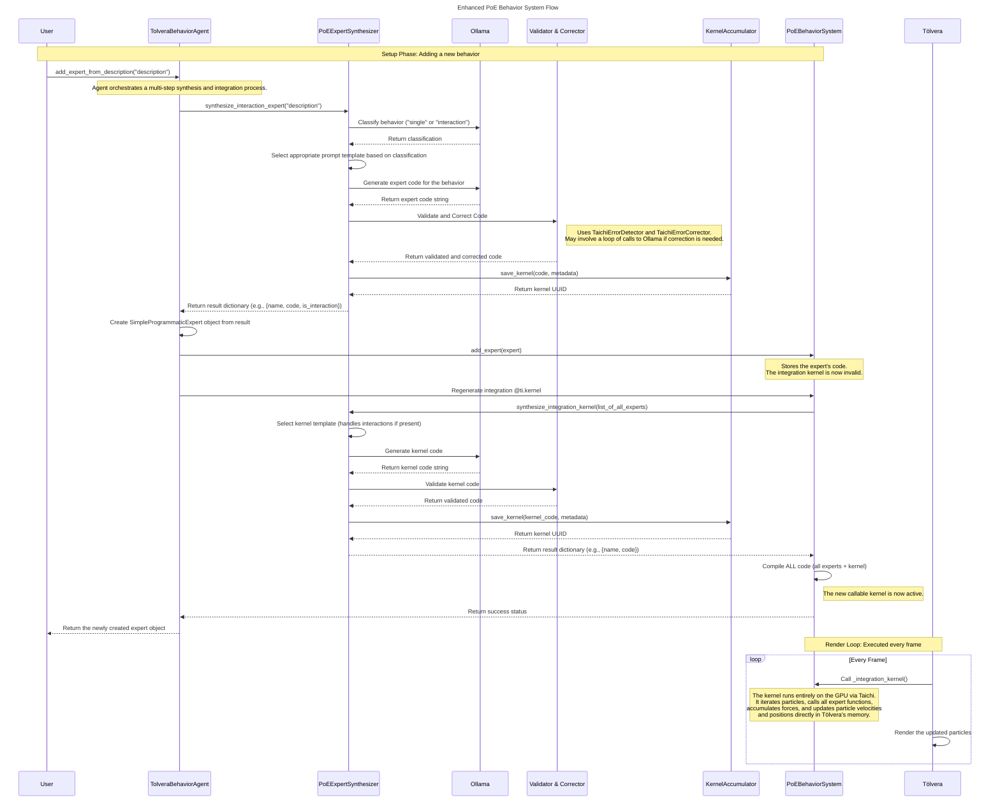

### Week 6: Giving the Experts More Brains

After getting the Product of Programmatic Experts (PoE) system up and running [last week](week5.md), the next step was to move beyond simple, independent particle behaviors. It was cool (because something finally worked 😅), but the particles were basically lonely little dots doing their own thing. To get the really interesting emergent behavior, the particles needed to be aware of each other. This week was all about making that happen, and tackling the annoying little errors the LLM likes to make along the way.

#### System Architecture

The enhanced PoE system now supports both single-particle behaviors and multi-particle interactions. Here's how the complete flow works:



The key innovation this week was adding the behavior classification step at the beginning, which routes descriptions to either single-particle or interaction expert synthesis. The system also now includes automatic error correction and kernel accumulation, making it more robust and creating a persistent record of all generated behaviors.

#### 1. Inter-Particle Interactions

The first big task was teaching the system the difference between a force like "gravity" (which affects every particle individually) and a behavior like "particles repel each other" (which depends on pairs of particles).

This led to a few upgrades in our system:

- **The Behavior Router:** I stuck a new LLM-powered classifier at the front of the pipeline. Its only job is to read the user's prompt and decide if it's a `SINGLE` particle behavior or an `INTERACTION`. Simple, but super important for what comes next.
- **Interaction Expert:** If the router says `INTERACTION`, the request gets sent to a new synthesizer that's built to generate functions that accept two particles (`p1`, `p2`). This lets the code calculate things based on their relationship, like the distance or species.
- **The Double-Loop Kernel:** The main integration kernel now runs a nested loop. The outer loop applies all the single-particle forces as usual, but then an inner loop runs through all the other particles to calculate and add in the interaction forces. This means we can mix and match global and local behaviors on the fly.

Getting the kernel logic right for the nested loops without tanking performance was a bit of a headache...but the result is that we can now create much more dynamic and complex simulations (yay!).

##### Demo 1: Chase Interaction

To test the interaction-specific synthesizer, we can provide a chase prompt. The system correctly identifies this as an `INTERACTION`, generates a two-particle expert, and integrates it into the main kernel.

![[demo6-1.mp4]]

<table>
<tr>
<td> User Description </td>
<td> Generated Expert Code </td>
<td> Included Experts </td>
</tr>
<tr>
<td> species 0 chases species 1 quickly </td>
<td>

'''python
@ti.func
def expert*chase_species_quickly(p1: ti.template(), p2: ti.template()) -> ti.math.vec2:
force = ti.math.vec2(0.0, 0.0)
if p1.species == 0 and p2.species == 1:
to_other = p2.pos - p1.pos
dist = to_other.norm()
if dist > 0.01 and dist < 300.0:
strength = 400.0 * (1.0 - dist / 300.0)
direction = to*other / dist
force = direction * strength
return force
'''

</td>
<td>

`expert_chase_quickly`

</td>
</tr>
</table>

##### Demo 2: Species-Based Attraction

Here, we test a different kind of interaction where particles of the same species group together. This requires the expert to compare the species of both particles in the pair.

![[demo6-2.mp4]]

<table>
<tr>
<td> User Description </td>
<td> Generated Expert Code </td>
<td> Included Experts </td>
</tr>
<tr>
<td> both species flock together within their own groups </td>
<td>

'''python
@ti.func
def expert_flock_within_species(p1: ti.template(), p2: ti.template()) -> ti.math.vec2:
force = ti.math.vec2(0.0, 0.0) # Flocking behavior within the same species group
if (p1.species == 0 and p2.species == 0) or (p1.species == 1 and p2.species == 1):
to_other = p2.pos - p1.pos
dist = to_other.norm()
if dist > 0.0 and dist < 50.0: # Flocking with distance-based strength
force = (to_other / dist) \* 100.0
return force
'''

</td>
<td>

`expert_flock_within_species`

</td>
</tr>
</table>

##### Demo 3: Composing Interaction and Single-Particle Forces

The most powerful feature is combining different expert types. Here, we create a simulation where two species repel one another, while all particles drift randomly. The system generates two separate experts and the kernel correctly aggregates their forces.

![[demo6-3.mp4]]

<table>
<tr>
<td> User Descriptions </td>
<td> Generated Expert Code </td>
<td> Included Experts </td>
</tr>
<tr>
<td> "species 0 hunts species 1, species 1 flees from species 0 rapidly" <br><br> "particles drift randomly" </td>
<td>

'''python
@ti.func
def expert*hunt_flee_species(p1: ti.template(), p2: ti.template()) -> ti.math.vec2:
force = ti.math.vec2(0.0, 0.0) # Check both directions for symmetric interaction
if (p1.species == 0 and p2.species == 1) or (p1.species == 1 and p2.species == 0):
to_other = p2.pos - p1.pos
dist = to_other.norm()
if dist > 0.0 and dist < 50.0: # Rapidly chase with distance-based strength
strength = 400.0 * (1.0 - dist / 50.0)
force = -(to*other / dist) * strength
return force

    @ti.func
    def expert_drift(pos: ti.math.vec2, vel: ti.math.vec2, mass: ti.f32, species: ti.i32) -> ti.math.vec2:
        angle = ti.random() * 2 * pi
        force_magnitude = 50.0
        force = ti.math.vec2(ti.cos(angle) * force_magnitude, ti.sin(angle) * force_magnitude)
        return force

'''

</td>
<td>

`expert_hunt_flee_species` <br> `expert_drift`

</td>
</tr>
</table>

#### 2. Auto-Corrector (Kinda...)

I was spending a ton of time debugging tiny errors from the LLM either in Python or Taichi syntax. These are documented mostly in the prompts from the "Do this, not this" kinda verbage. We ended up thinking an agent might be the way to go for fixing this up so I worked on that a bit this week. Currently it only fixes up some common errors and then prompts the LLM with the error code to try and fix the error.

- **`TaichiErrorDetector`**: Mostly a linter specifically for LLM-generated Taichi code. It's a class with a lot of regex patterns that I've collected from watching the LLM fail over and over. It scans the generated code and flags anything that looks suspicious before we even try to run the code itself. Common pitfalls are caught here.
- **`TaichiErrorCorrector`**: If the detector finds any problems, this corrector agent kicks in. It first tries a round of simple, rule-based fixes for the easy stuff. If errors are still left, it bundles up the broken code and the list of errors and sends it _back_ to the LLM with a very stern prompt: "Fix _these specific things_ and nothing else."

It's not perfect, but it catches the vast majority of the LLM's common slip-ups that I've found for these simple prompts right now.

#### 3. The Kernel Accumulator

This is a simple class that saves every single successfully generated function to a `kernels_repository.py` file. Here we also annotate each function with a docstring containing metadata: a UUID, the exact prompt that created it, the model name, and a timestamp.

This gives me a persistent, searchable file of every behavior the system has ever created. I can use it to see what works, what doesn't, and maybe even use it to fine-tune a model down the line??? Right now we're just storing things here, but it'll probably be used for fine-tuning

##### Demo: Kernel Accumulation

```python
@ti.func
def expert_mutual_repel_strong_dd70348d(p1: ti.template(), p2: ti.template()) -> ti.math.vec2:
    """
    Generated expert kernel

    Metadata:
    - UUID: dd70348d-69f8-4331-be6d-35cbfcaca150
    - Original Name: expert_mutual_repel_strong
    - Prompt: "species 0 and species 1 repel each other strongly"
    - Model: qwen2.5:3b
    - Type: expert
    - Generated: 2025-07-08T23:41:38.573520

    - description: species 0 and species 1 repel each other strongly
    - is_interaction: True
    """
    force = ti.math.vec2(0.0, 0.0)
    # Check both directions for symmetric interaction
    if (p1.species == 0 and p2.species == 1) or (p1.species == 1 and p2.species == 0):
        to_other = p2.pos - p1.pos
        dist = to_other.norm()
        if dist > 0.0 and dist < 50.0:
            force = -(to_other / dist) * 400.0  # Strong repulsion with distance cutoff
    return force
```
