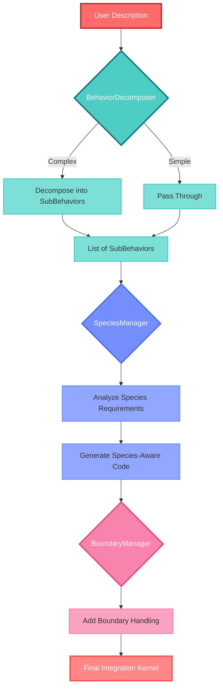

### Week 7: Making Complex Behaviors Actually Work

After getting interactions working [last week](week6.md), we had a new problem: users don't always describe behaviors in nice, atomic chunks that map cleanly to single expert functions 😅. Real descriptions are messy for our system in that they combine multiple behaviors, include conditional logic, and often describe multi-species scenarios in a single sentence. This week was all about making the system robust enough to handle that complexity without completely breaking.

The code for this week can be seen [here](https://github.com/mclemcrew/tolvera/tree/poe-interaction-demo) with demos showcasing the new capabilities.

#### System Architecture Updates

The system now includes three new components that work together to handle complex behavior synthesis:



#### 1. The Behavior Decomposer

The first big addition was `BehaviorDecomposer` which is essentially a pre-processor that looks at user descriptions and decides if they're too complex for a single expert function. It's surprisingly decent at this.

The decomposer uses a two-stage approach:

- **Heuristic Analysis:** First, it scans for complexity indicators using regex patterns. Things like "while", "and", "but", "then", multiple species mentions, etc. If it finds enough red flags, it knows decomposition is needed.
- **LLM-Assisted Decomposition:** For borderline cases (complexity score = 1), it asks the LLM to make the call. If decomposition is needed, it prompts the LLM to break down the behavior into atomic components, each with its own weight and relationship type.

Here's what it catches:

```python
complexity_indicators = [
    r'\bwhile\b',           # "A while B"
    r'\band\b',             # "A and B"
    r'\bbut\b',             # "A but B"
    r'\bthen\b',            # "A then B"
    r',\s*(and|while)',     # Lists with conjunctions
    r'at the same time',    # Explicit simultaneity
    r'simultaneously',      # Explicit simultaneity
    r'multiple species',    # Multi-species interactions
    r'species \d+.*species \d+.*species \d+',  # 3+ species mentioned
]
```

Each sub-behavior gets tagged with a relationship type:

- **independent**: Can run on its own
- **simultaneous**: Should run at the same time as others
- **conditional**: Only applies under certain conditions
- **sequential**: Should run in a specific order

##### Demo: Complex Behavior Decomposition

When given a description like "particles migrate to the center but repel each other when too close", the decomposer breaks it down into:

1. `particles migrate to the center` (weight: 1.5, relationship: independent)
2. `particles repel each other when close` (weight: 1.0, relationship: conditional)

Each sub-behavior then gets synthesized separately and integrated with weights.

![[demo7-1.mp4]]

#### 2. Species Management That Actually Makes Sense

The `SpeciesManager` tackles another pain point: figuring out which species a simulation actually needs. Previously, we'd just default to species 0 and 1, but that's pretty limiting.

The manager analyzes all behaviors to determine:

- Which species IDs are explicitly mentioned
- Whether behaviors require multiple species (for interactions)
- If any behaviors apply to all species generically
- What interaction pairs exist

Based on this analysis, it generates appropriate initialization code:

```python
@ti.kernel
def init_particles():
    # Initialize particles with species IDs: [0, 1, 2]
    for i in range(tv.pn):
        tv.p.field[i].active = 1.0
        tv.p.field[i].pos = ti.Vector([ti.random() * tv.x, ti.random() * tv.y])
        tv.p.field[i].vel = ti.Vector([0.0, 0.0])
        tv.p.field[i].size = 5.0
        tv.p.field[i].mass = 1.0
        # Assign particles to only the specified species IDs
        if i % 3 == 0:
            tv.p.field[i].species = 0
        elif i % 3 == 1:
            tv.p.field[i].species = 1
        elif i % 3 == 2:
            tv.p.field[i].species = 2
```

It also handles species-specific force application in the integration kernel. If an expert only applies to certain species, the manager adds the appropriate conditionals:

```python
if species == 0 or species == 2:
    total_force += expert_gravity(pos, vel, mass, species) * 1.00
```

#### 3. Boundary Behaviors

The `BoundaryManager` adds another dimension to simulations by handling what happens at screen edges. Instead of particles just wrapping at the screen boundaries (which we had by default for the last few weeks), we now support four modes:

- **NONE**: Default behavior (particles can go off-screen)
- **WRAP**: Toroidal topologyparticles wrap around edges
- **BOUNCE**: Particles reflect off edges with energy loss
- **ABSORB**: Particles are deactivated when they hit edges

The manager analyzes behavior descriptions for boundary keywords and automatically applies the appropriate handling:

```python
# Bounce mode example
if new_pos[0] < 0:
    new_pos[0] = -new_pos[0]
    tv.p.field[i].vel[0] = -tv.p.field[i].vel[0] * 0.8  # Energy loss
elif new_pos[0] > tv.x:
    new_pos[0] = 2 * tv.x - new_pos[0]
    tv.p.field[i].vel[0] = -tv.p.field[i].vel[0] * 0.8
```

##### Demo: Bouncing Particles

With a description like "particles bounce off walls while being attracted to the center", the system:

1. Decomposes into two behaviors (bounce + attraction)
2. Detects the boundary requirement (BOUNCE mode)
3. Generates appropriate boundary handling code
4. Creates a simulation where particles are pulled to center but bounce realistically off edges

#### Synthesis

Here's what happens with a complex description like "species 0 chases species 1 while species 1 flees, and all particles bounce off walls":

1. **Decomposer** breaks it into:

   - "species 0 chases species 1" (interaction)
   - "species 1 flees from species 0" (interaction)
   - "particles bounce off walls" (boundary behavior)

2. **SpeciesManager** determines:

   - Need species 0 and 1
   - Two interaction pairs: (0,1) and (1,0)
   - Sets up appropriate species initialization

3. **BoundaryManager** detects:
   - BOUNCE mode required
   - Adds reflection code to kernel

The result is a multi-behavior simulation generated from a single natural language description, with proper species handling and realistic physics at the boundaries.

#### Technical Challenges

Here's a brief list of the challenges I encountered this week:

- **Decomposition Ambiguity**: Sometimes the LLM would decompose behaviors differently on repeated runs. Added more structure to the prompts and examples to improve consistency.
- **Weight Balancing**: When behaviors conflict (like "move right but stay near center"), getting the weights right is critical. Added weight adjustment logic based on keywords like "stronger than" or "weaker than". This is still a problem though...it's not completely resolved.
- **Boundary Edge Cases**: Particles moving at high speeds could clip through boundaries if it wasn't calculating fast enough with the frame rate. Had to add proper collision prediction in the boundary handling code.

#### What's Next

You can check out the [midterm](midterm.md) report for what's next for the remainder of the GSoC.

But for now, I'm just happy that "species 0 and 1 chase each other in circles while bouncing off walls and species 2 wanders randomly" actually works 🥳
