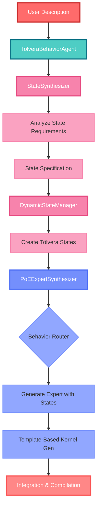

### Week 8: Dynamic State Generation

After implementing decomposition and species management [last week](week7.md), we hit another fundamental limitation: behaviors often require custom states that don't exist in the base Tölvera system. Asking the LLM to work with only the default particle properties (position, velocity, mass, etc.) limited the types of behaviors we could generate. We have had some great success from prior weeks with effective program generation/synthesis, but there wasn't necessarily a direct tie into the artificial life portion of the project quite yet. This week's work focused on building a dynamic state generation system that automatically creates the states a behavior needs, paired with a template-based approach to ensure the generated code actually works. Yes...that's right... I tried out the jinja2 template approach for this based on some research we found [here](https://arxiv.org/abs/2409.00921). After the initial state generation, I had a lot of issues with errors constantly, so I went back to this JSON approach with Pydantic for the states and then the rest were left as typed holes.

The code for this week can be seen in the [state-generation-demo branch](https://github.com/mclemcrew/tolvera/tree/state-generation-demo) with the enhanced demo at [poe_demo.py](https://github.com/mclemcrew/tolvera/blob/state-generation-demo/examples/poe_demo.py).

#### State Generation Problem

Previously, when a user requested something like "particles move faster during the day and rest at night", the LLM would either:

1. Try to hack it using existing states (storing time in unused fields like `mass`)
2. Create overly complex workarounds that didn't really capture the intended behavior
3. Straight up ignore the request and just pretend it did something :)

What we needed was a way for the system to:

- Analyze the behavior description and identify required states
- Create those states dynamically appropriate types and ranges
- Assert the generated expert code correctly accesses these states (experts grabbing those states)
- Handle temporal updates for time-based states (the main focus this week)

#### Updated System Architecture

The updated arch now includes state synthesis as a core component:



#### State Synthesis Pipeline

##### 1. State Analysis (`StateSynthesizer`)

The first step analyzes the natural language description to determine what states are needed:

```python
# From state_synthesizer.py
async def analyze_state_requirements(self, description: str) -> Dict[str, Any]:
    """
    Analyze behavior description and return required states using structured outputs.

    Returns:
        Dictionary containing:
        - global_states: Global properties (e.g., day_phase, time)
        - particle_states: Per-particle properties (e.g., energy, age)
        - species_states: Per-species properties
        - temporal_config: Time configuration if needed
    """
```

The LLM is prompted with the behavior description and returns a structured specification. For "particles move faster during the day and rest at night", it identifies:

- **Global state**: `time_of_day` (ti.f32, 0.0-1.0) - tracks day/night cycle
- **Particle state**: `movement_speed` (ti.f32, 0.0-100.0) - individual particle speeds
- **Temporal config**: day_duration=10.0 seconds

##### 2. Dynamic State Creation (`DynamicStateManager`)

Once we have the state specification, the `DynamicStateManager` creates actual Tölvera states:

```python
# From dynamic_state_manager.py
def create_states_from_spec(self, state_spec: Dict[str, Any]) -> Dict[str, str]:
    """
    Create Tölvera states based on the specification from StateSynthesizer.
    """
    created_states = {}

    # Create global states
    if 'global_states' in state_spec and state_spec['global_states']:
        state_name = self._create_global_states(state_spec['global_states'])
        created_states['global'] = state_name

    # Create particle states
    if 'particle_states' in state_spec and state_spec['particle_states']:
        state_name = self._create_particle_states(state_spec['particle_states'])
        created_states['particle'] = state_name

    # Create species states
    if 'species_states' in state_spec and state_spec['species_states']:
        state_name = self._create_species_states(state_spec['species_states'])
        created_states['species'] = state_name

    # Same thing for temporal states too...
```

The manager creates states with proper Taichi types and integrates them into Tölvera's state system. States are namespaced (e.g., `llm_global`, `llm_particle`) to avoid conflicts with built-in states.

_This could be an oversight for me because I'm suggesting grouping here and that might not be the best way to handle that...could try calling the LLM to make this too_

##### 3. Typed Template Generation

This was a shot in the dark to see if the "typed holes" approach worked well. I didn't have time to test everything (species information, interaction characteristcs, etc), but here's what I have right now:

```python
# Template for expert functions
@ti.func
def expert_{{ name }}(pos: ti.math.vec2, vel: ti.math.vec2, mass: ti.f32, species: ti.i32, particle_idx: ti.i32) -> ti.math.vec2:
    # TYPED CONTEXT: State access
    
    {{ state_access }}
    

    # TYPED HOLE[ti.math.vec2]: Force calculation
    {{ force_calculation }}

    return force
```

This approach ensures:

- Correct function signatures
- Proper state access patterns
- Variables declared before use
- Correct return types

This is essentially a list of all the things I was running into during generation so that's why we went with this :)

#### Walkthrough

For a demonstration of this since there's a lot of moving parts, let's trace through the example _"particles move faster during the day and rest at night"_:

##### Step 1: Natural Language Input

```python
# User provides description
description = "particles move faster during the day and rest at night"
```

##### Step 2: State Analysis

```
StateSynthesizer - INFO - Analyzing state requirements
StateSynthesizer - INFO - Structured state analysis successful
```

The LLM analyzes and returns:

```json
{
  "global_states": {
    "time_of_day": {
      "type": "ti.f32",
      "min": 0.0,
      "max": 1.0,
      "description": "A value between 0.0 (night) and 1.0 (day)"
    }
  },
  "particle_states": {
    "movement_speed": {
      "type": "ti.f32",
      "min": 0.0,
      "max": 100.0,
      "description": "The speed at which the particle moves"
    }
  },
  "temporal_config": {
    "day_duration": 10.0,
    "frame_rate": 60.0
  }
}
```

##### Step 3: State Creation

```
DynamicStateManager - INFO - Created global state 'llm_global' with properties: ['time_of_day']
DynamicStateManager - INFO - Created particle state 'llm_particle' with properties: ['movement_speed']
```

The manager creates Tölvera states that can be accessed in Taichi kernels.

##### Step 4: Expert Synthesis with State Context

```
PoEExpertSynthesizer - INFO - Classifying behavior: 'particles move faster during the day and rest at night'
PoEExpertSynthesizer - INFO - Behavior classified as: SINGLE
```

The synthesizer generates an expert function with state access:

```python
@ti.func
def expert_day_night(pos: ti.math.vec2, vel: ti.math.vec2, mass: ti.f32, species: ti.i32, particle_idx: ti.i32) -> ti.math.vec2:
    # Access states
    time_of_day = tv.s.llm_global.field[0].time_of_day
    speed_multiplier = tv.s.llm_particle.field[particle_idx].movement_speed

    # Initialize force before conditionals
    force = ti.math.vec2(0.0, 0.0)

    # Random movement
    angle = ti.random() * 2 * 3.14159
    base_force = ti.math.vec2(ti.cos(angle), ti.sin(angle)) * 150.0

    # Scale based on day/night
    if time_of_day > 0.5:  # Day
        force = base_force * speed_multiplier
    else:  # Night
        force = base_force * 0.1

    return force
```

##### Step 5: State Reference Validation

The system can detect if the wrong state name was used and automatically calls the LLM to try and correct them.

##### Step 6: Integration Kernel Generation

```
PoESynthesizer - INFO - Synthesizing integration kernel using template approach
```

Using templates, the system generates a kernel that properly accesses all states, calls experts with correct parameters, updates particles with accumulated forces, and handles boundary conditions

##### Step 7: Temporal Update Generation

We needed a way to push the clock forward so to speak for this, so we add an update_temporal_states method if there is something in the temporal states and then we go from there.

```python
@ti.kernel
def update_temporal_states():
    """Update time-based global states."""
    # Define temporal constants from configuration
    frames_per_day = 600.0  # 10 seconds at 60 FPS

    # Update time of day
    frame_in_day = tv.frame_count % frames_per_day
    tv.s.llm_global.field[0].time_of_day = frame_in_day / frames_per_day
```

##### Step 8: Final Compilation and Execution

```
PoECore - INFO - Integration kernel successfully regenerated
```

The complete system is compiled and ready to run (hopefully 🤞).

#### Demo: Day/Night Particle Behavior

![[demo8-1.mp4]]

The video shows particles with the "move faster during the day and rest at night" behavior.

#### Recap

1. **Automatic State Discovery**: The LLM analyzes behaviors and identifies needed states without human intervention.

2. **Type-Safe State Creation**: States are created with Taichi types and value ranges

3. **Template-Based Code Generation**: Using typed holes ensures:

   - Variables always declared before use
   - Correct parameter order in function calls
   - Proper state access patterns
   - No undefined variable references

4. **State Context Propagation**: The system maintains state information throughout the pipeline

5. **Temporal State Updates**: Time-based behaviors get automatic update kernels that run each frame.

#### Key Issues We Had

- **State Name Consistency**: The LLM would often generate different names for the same state. We now validate and correct references automatically.
- **Declaration Order**: LLMs often use variables before declaring them. Templates enforce proper declaration order with the sketch.
- **Type Mismatches**: States are created with explicit types, preventing the LLM from treating floats as vectors or vice versa.

#### Results

The state generation system dramatically expands what behaviors can be expressed (which is great) but this next week will focus mostly on fixing this up and making sure the other aspects of this whole system are robust enough to handle this huge structural change.

#### What's Next

While the state generation works well, we have another long week ahead to make sure this is working how we intended. I'm not certain if it's going to be robust enough to handle the species implementation so a lot of that code will need to be cleaned up before any of it is fully usable.

The foundation is solid though - we can now generate artificial life simulations from natural language descriptions. The LLM handles the complexity while the system ensures the generated code actually works.

#### Detailed Code Execution Walkthrough

To better understand how all the pieces fit together, let's trace through exactly what happens when running `poe_demo.py` with our example behavior:

##### 1. Demo Initialization (`poe_demo.py:186-201`)

```python
async def demo_simple_behaviors():
    tv_config = {
        "particles": 100,
        "px": "pixels",
        "gpu": "metal" if sys.platform == "darwin" else "cuda"
    }

    tv = Tolvera(**tv_config)
    agent = TolveraBehaviorAgent(tv)
    synthesizer = PureLLMSynthesizer(model_name="qwen3:4b", enable_decomposition=False, tolvera_instance=tv)
```

**What happens:**

- Creates Tölvera instance with 100 particles
- Initializes `TolveraBehaviorAgent` (poe_integration.py) to orchestrate the synthesis
- Creates synthesizer with state generation enabled

##### 2. Behavior Addition (`poe_demo.py:255-261`)

```python
expert = await agent.add_expert_from_description(
    description,
    synthesizer.synthesizer,
    weight=weight,
    use_decomposition=False,
    use_states=True  # Enable state synthesis
)
```

**Calls:** `TolveraBehaviorAgent.add_expert_from_description()` (poe_integration.py:89)

##### 3. State Analysis Phase (`poe_integration.py:115-127`)

```python
# In add_expert_from_description
if use_states and hasattr(synthesizer, 'synthesize_with_states'):
    result = await synthesizer.synthesize_with_states(
        description, self.tolvera_instance
    )
```

**Calls:** `PoEExpertSynthesizer.synthesize_with_states()` (poe_synthesis.py:456)

##### 4. State Requirements Analysis (`poe_synthesis.py:463-473`)

```python
# In synthesize_with_states
state_spec = await self.state_synthesizer.analyze_state_requirements(description)
```

**Calls:** `StateSynthesizer.analyze_state_requirements()` (state_synthesizer.py:59)

This sends the structured prompt to the LLM and gets back the state specification.

##### 5. Dynamic State Creation (`poe_synthesis.py:481-492`)

```python
# Still in synthesize_with_states
if state_spec and any_states:
    created_state_names = self.state_manager.create_states_from_spec(state_spec)
```

**Calls:** `DynamicStateManager.create_states_from_spec()` (dynamic_state_manager.py:51)

This creates the actual Tölvera states:

- `_create_global_states()` → Creates `tv.s.llm_global` with `time_of_day` field
- `_create_particle_states()` → Creates `tv.s.llm_particle` with `movement_speed` field

##### 6. Expert Function Generation (`poe_synthesis.py:495-510`)

```python
# Generate expert with state context
state_context = self.state_manager.get_synthesis_context()
# ... behavior classification ...
function_result = await self._generate_single_particle_expert(
    description, existing_names, state_context
)
```

**Calls:** `PoEExpertSynthesizer._generate_single_particle_expert()` (poe_synthesis.py:665)

The LLM generates the expert function with access to the state documentation.

##### 7. Error Detection and Correction (`poe_synthesis.py:726-751`)

```python
# Validate and fix state references
invalid_refs = self._validate_state_references(code, state_context)
if invalid_refs:
    code = await self._fix_invalid_state_references(
        code, invalid_refs, state_context, description
    )
```

The system detects if the LLM used wrong state names and corrects them.

##### 8. Kernel Accumulation (`poe_synthesis.py:797-802`)

```python
# Save successful kernel
if self.kernel_accumulator:
    uuid = self.kernel_accumulator.save_kernel(
        final_code, metadata
    )
```

**Calls:** `KernelAccumulator.save_kernel()` → Saves to `kernels_repository.py`

##### 9. Integration Kernel Generation (`poe_integration.py:163-166`)

```python
# Back in add_expert_from_description
self.poe_system.regenerate_integration_kernel(synthesizer)
```

**Calls:** `PoEBehaviorSystem.regenerate_integration_kernel()` (poe_core.py:234)

##### 10. Template-Based Kernel Synthesis (`poe_synthesis.py:1053-1089`)

```python
# In synthesize_integration_kernel_template
template = self.template_env.get_template('integration_kernel.j2')
# Get kernel configuration from LLM
config = await self._get_kernel_configuration(expert_info)
# Render template
kernel_code = template.render(config)
```

The template ensures proper structure while the LLM provides the configuration.

##### 11. Temporal Update Generation (`poe_demo.py:295-302`)

```python
# Generate temporal update code if needed
update_code = await synthesizer.synthesizer.state_synthesizer.generate_state_update_code(
    state_spec, temporal_config, behavior_desc
)
```

**Calls:** `StateSynthesizer.generate_state_update_code()` (state_synthesizer.py:343)

##### 12. Final Sketch Generation (`poe_demo.py:304`)

```python
filename = save_generated_sketch_to_file(agent, tv_config, state_update_code=state_update_code)
```

This creates the final Python file.

##### Key Files

- **poe_demo.py**: Entry point and orchestration
- **poe_integration.py**: High-level behavior agent that coordinates the process
- **state_synthesizer.py**: Analyzes descriptions to determine state requirements
- **dynamic_state_manager.py**: Creates actual Tölvera states from specifications
- **poe_synthesis.py**: Generates expert functions and integration kernels
- **poe_ollama.py**: Handles LLM communication
- **taichi_error_detector.py**: Detects common code generation errors
- **state_code_generator.py**: Generates state initialization code
- **Templates** (in `llm/templates/`):
  - `expert_template.j2`: Template for expert functions
  - `integration_kernel.j2`: Template for the main kernel

The entire flow from natural language to working simulation involves orchestration of state analysis, dynamic creation, code generation with templates, error correction, and compilation - all working together to produce reliable, particle simulations. It's starting to get very complex here, but we're on to something with this approach! Stoked with how this turned out and excited to see where this goes in the coming days!
