### Week 9: From Forces to Life

After building out the state generation and decomposition systems over the [past](week7.md) [weeks](week8.md), we hit an architectural limitation: everything in our system was built around the assumption that behaviors return forces. This works great for flocking, attraction, and physics-based simulations, but completely falls apart when you try to implement Conway's Game of Life or a Physarum slime mold. Those aren't necessairily force-based systems, they're about state transitions, environmental sensing, and substrate modification. This week was about removeing that constraint and enabling artificial life patterns to emerge.

The code for this week is in the [a-life-demo branch](https://github.com/mclemcrew/tolvera/tree/a-life-demo) with updates to the synthesis pipeline.

_To preface this week, not a ton got done since I was in the midst of interviewing and a baby shower for my sibling so most of this was done in around 2-3 days...thus not a huge update this week._

#### The Force-Only Problem

Every expert function had to return a `ti.math.vec2` force. Want to implement GoL? Too bad, you can't return "alive" or "dead" as a force vector necessarily. Want slime molds that deposit pheromones? Sorry, deposition isn't a forc reallye. The system was limited to one type of computation as we just were focusing on physics based implementations (which was fine for the beginning, but we're trying to expand these capabilities)

Foundation models like Gemini-Pro and Claude were generating beautiful implementations of complex AL patterns that our smaller local models couldn't replicate (yet...hopefully :)). Here's what those foundation models can achieve:

![[demo9-boids.mp4]]
_Boids flocking with alignment, cohesion, and separation behaviors_

![[demo9-gol.mp4]]
_Conway's Game of Life with proper cell state transitions_

![[demo9-slime.mp4]]
_Physarum slime mold with pheromone sensing and deposition_

Meanwhile, our small models? The errors were... painful. You can check some out at [Errors.md](examples/Errors.md) - undefined variables, wrong function signatures, attempting to access non-existent fields. This is still a problem and about 90% of the time for the ALife examples, everything just simply breaks.

**_Please Note: The demos you are seeing which are great still needed quite a bit of revisions back and forth just to get things running right off the bat._**

#### New Expert Types for AL

The solution was to expand beyond force-returning experts. We created three new expert types, each with its own purpose and return type:

1. **State Transition Experts** (`expert_state_transition.j2`)

   - Return `ti.i32` for discrete state changes
   - Perfect for cellular automata, life/death cycles, mode switching
   - Example: Game of Life cell updates

2. **Sensor Experts** (`expert_sensor.j2`)

   - Return `ti.f32` for environmental readings
   - Used for counting neighbors, detecting pheromones, measuring local density
   - Example: counting live neighbors in cellular automata

3. **Deposit Experts** (`expert_deposit.j2`)
   - Void functions that write to the environment
   - For laying pheromone trails, marking territory, modifying substrates
   - Example: slime molds depositing chemical signals

Each type has its own Jinja2 template ensuring correct function signatures and parameter access patterns.

#### Kernel Architecture Update

With multiple expert types, we needed a new integration kernel that could orchestrate them properly. This is the attempt for that: (`integration_kernel_multimodal.j2`):

```python
@ti.kernel
def poe_integrate_behaviors(tv: ti.template()):
    for i in range(tv.p.field.shape[0]):
        # Phase 1: Sensor readings
        count_neighbors = expert_count_neighbors(pos, vel, species, tv)

        # Phase 2: State transitions
        new_state = expert_cell_update(pos, vel, current_state, species)

        # Phase 3: Force calculations
        total_force = expert_attraction(pos, vel, mass, species)

        # Phase 4: Environmental deposits
        expert_deposit_pheromone(pos, vel, species, i, tv)

        # Apply updates...
```

The phases execute in order where the sensors read the environment before state transitions, forces are calculated on updated states, and deposits happen after movement. You can think of this like the `apply_all_experts` kernel.

#### Fixing Small Model Classification

This is NOT what I want at all, nor what we want to go with, but for right now, this was a quick fix to get something working with all the errors I was getting: a keyword detection for classification for these types of behaviors.

The fix was surprisingly simple: go back to basics with keyword detection:

```python
def _keyword_classify_behavior(self, description: str) -> str:
    """Keyword-based classification for small models."""
    desc_lower = description.lower()

    # Sensor keywords
    if any(word in desc_lower for word in ['sense', 'detect', 'measure', 'count']):
        return "SENSOR"

    # Deposit keywords
    if any(word in desc_lower for word in ['deposit', 'leave', 'mark', 'trail']):
        return "DEPOSIT"

    # State transition keywords
    if any(word in desc_lower for word in ['become', 'die', 'alive', 'transition']):
        return "STATE_TRANSITION"

    # Default to force for physics behaviors
    return "FORCE"
```

The LLM classification is now just a fallback for ambiguous cases, not the first approach. The prompt was bad so that's my fault on this.

#### The Template Parameter Nightmare

One of the most frustrating bugs this week involved template parameter mismatches. The kernel template was putting all experts in the force phase, regardless of type.

```python
# WRONG - uses raw expert lists
'single_experts': [e for e in experts if not e.metadata.get('is_interaction')],

# RIGHT - uses categorized experts
'single_experts': categorized['force_single'],
'sensor_experts': categorized['sensor'],
'deposit_experts': categorized['deposit'],
```

Also had to fix parameter lists for different expert types. Sensor and deposit experts don't need mass, but they do need access to the Tölvera instance. The template now generates correct calls for each phase.

#### Current Issues and Synthesis Quality

Even with all these improvements, we're still fighting synthesis quality issues including some of the following errors:

1. **Empty for loops** causing IndentationErrors
2. **Undefined variables** like expecting `particle_idx` without receiving it
3. **Non-existent field access** like `tv.s.llm_pheromone` when that field doesn't exist
4. **Wrong return types** - state transition experts returning vec2 instead of i32

The templates help by providing structure, but the LLM still has to fill in the logic correctly. We're exploring a few solutions:

- More explicit examples in prompts
- Pre-validated code snippets the LLM can adapt (through either more templates or constrained generation or things like that)
- Typed holes that further constrain what the LLM can generate
- Building a library of successful patterns to reference (we have some of this already implemented but not fully using this yet)

#### Demo Results

Ugh. This week was very frustrating for the demo. Even though the Physarum demo correctly generates four different expert types working together:

1. Sensor expert detects pheromone concentrations
2. Force expert turns particles toward high concentrations
3. Another force expert adds random movement
4. Deposit expert lays pheromone trails

There are always one or two errors that need to be fixed for it to even be able to run. Even when it runs, it doesn't really resemble what the prompt was supposed to represent, such as slime which looks like this with an initial pass.

![[demo9-demo1.mp4]]

#### What We Did

Here's what we started, but really nothing has been finished for this week:

 **New expert types** for state transitions, sensing, and deposition
 **Enhanced state system** supporting discrete states and grid coordinates  
 **Integration kernel updates** with proper phase execution
 **Grid initialization** for cellular automata patterns (beacuse gol definitely needed this)
 **8 classic AL patterns** ready to generate (Game of Life, Physarum, Boids, etc.)

The remaining issues are mostly about code generation quality.

#### Where to Next

We've gone from a force-only particle system to something that can express cellular automata, slime molds, and multi-phase behaviors. The system can now handle "particles count their neighbors, die if lonely, and leave ghostly trails" as naturally as "particles attract to center."

Is the generated code perfect? Good even? No. Absolutely not 😅. But we've proven the architecture works. With better prompts, larger models, or more constraints, the synthesis quality will improve.

Next week: tackling those synthesis quality issues and making sure all 8 demo patterns actually run without errors. If we can get Game of Life working reliably with a 4B parameter model, we'll really have something really powerful, I think, for the rest of everything :)

#### AL Pattern Generation Flow

Here's what actually happens when you select an artificial life pattern from `poe_demo.py`:

```mermaid
graph TD
    subgraph "Input & Decomposition"
        A[User Selects AL Pattern<br/>e.g. 'Physarum slime mold']:::user
        B[poe_demo.py<br/>demo_artificial_life]:::entry
        C[TolveraBehaviorAgent<br/>add_expert_from_description]:::agent
        D{BehaviorDecomposer<br/>Complex Behavior?}:::decomposer
        E[Decompose into SubBehaviors]:::decomposer
        F[List of Atomic Behaviors<br/>1. sense pheromones<br/>2. turn towards concentration<br/>3. move forward<br/>4. deposit trails]:::decomposer
        G[Single Behavior]:::decomposer

        A --> B --> C --> D
        D -->|Yes| E --> F
        D -->|No| G
    end

    subgraph "Behavior Processing Loop"
        H[For Each Behavior]:::loop
        I{Keyword Classifier<br/>_keyword_classify_behavior}:::classifier
        J[SENSOR Expert]:::sensor
        K[DEPOSIT Expert]:::deposit
        L[FORCE Expert]:::force
        M[STATE_TRANSITION Expert]:::state
        N[State Analysis<br/>StateSynthesizer]:::state_syn
        O[Generate State Spec]:::state_syn
        P[DynamicStateManager<br/>Create Tölvera States]:::state_mgr
        Q[States Created]:::state_mgr
        R[Expert Synthesis<br/>with State Context]:::synthesis
        S[Generate Taichi Function]:::synthesis
        T{Error Detection<br/>TaichiErrorDetector}:::error
        U[Error Correction<br/>TaichiErrorCorrector]:::error
        V[Add Expert to System]:::success
        W{All Behaviors<br/>Processed?}:::loop

        F --> H
        G --> H
        H --> I
        I -->|'sense'| J
        I -->|'deposit'| K
        I -->|'turn/move'| L
        I -->|'die/alive'| M
        J & K & L & M --> N
        N --> O --> P --> Q --> R --> S --> T
        T -->|Errors Found| U --> T
        T -->|No Errors| V --> W
        W -->|No| H
    end

    subgraph "Kernel Generation"
        X[Select Kernel Template]:::kernel
        Y{Expert Types?}:::kernel
        Z[integration_kernel.j2]:::kernel
        AA[integration_kernel_multimodal.j2]:::kernel
        AB[Categorize Experts by Type]:::kernel
        AC[Generate Multimodal Kernel]:::kernel
        AD[Generate Simple Kernel]:::kernel

        W -->|Yes| X --> Y
        Y -->|Only Force| Z --> AD
        Y -->|Mixed Types| AA --> AB --> AC --> AD
    end

    subgraph "Finalization & Execution"
        AE{Grid Initialization?<br/>SpeciesManager}:::species
        AF[initialize_particles_grid]:::species
        AG[initialize_particles_random]:::species
        AH[Generate Temporal Updates]:::temporal
        AI[Save to File]:::output
        AJ[Run Sketch]:::run
        AK[Render Loop]:::render

        AD --> AE
        AE -->|Yes| AF
        AE -->|No| AG
        AF & AG --> AH
        AH --> AI --> AJ --> AK
    end

    subgraph "Error Handling"
        AL[Synthesis Error]:::error_state
        AM[Logged to CSV]:::log
        AN[Runtime Error]:::error_state

        S -.->|Generation Fails| AL --> AM
        AK -.->|Runtime Error| AN
    end

    classDef user fill:#4ecdc4,stroke:#0b7285,stroke-width:3px,color:#fff
    classDef entry fill:#748ffc,stroke:#4c6ef5,stroke-width:3px,color:#fff
    classDef agent fill:#91a7ff,stroke:#748ffc,stroke-width:2px
    classDef decomposer fill:#f783ac,stroke:#e64980,stroke-width:3px,color:#fff
    classDef classifier fill:#ffa94d,stroke:#fd7e14,stroke-width:3px,color:#fff
    classDef sensor fill:#8ce99a,stroke:#51cf66,stroke-width:2px
    classDef deposit fill:#74c0fc,stroke:#339af0,stroke-width:2px
    classDef force fill:#ffa8a8,stroke:#ff6b6b,stroke-width:2px
    classDef state fill:#d0bfff,stroke:#9775fa,stroke-width:2px
    classDef state_syn fill:#c5f6fa,stroke:#22b8cf,stroke-width:2px
    classDef state_mgr fill:#96f2d7,stroke:#20c997,stroke-width:2px
    classDef synthesis fill:#ffd43b,stroke:#fab005,stroke-width:2px
    classDef error fill:#ffe066,stroke:#fcc419,stroke-width:2px
    classDef success fill:#b2f2bb,stroke:#40c057,stroke-width:2px
    classDef loop fill:#e9ecef,stroke:#868e96,stroke-width:2px
    classDef kernel fill:#ff8787,stroke:#fa5252,stroke-width:3px,color:#fff
    classDef species fill:#a5d8ff,stroke:#339af0,stroke-width:2px
    classDef temporal fill:#fcc2d7,stroke:#f06595,stroke-width:2px
    classDef output fill:#99e9f2,stroke:#3bc9db,stroke-width:2px
    classDef run fill:#ffec99,stroke:#ffd43b,stroke-width:2px
    classDef render fill:#c3fae8,stroke:#63e6be,stroke-width:2px
    classDef error_state fill:#ffc9c9,stroke:#ff6b6b,stroke-width:3px,color:#c92a2a
    classDef log fill:#e9ecef,stroke:#868e96,stroke-width:2px
```



The diagram shows the flow from user selection to running simulation. Key points:

1. **Decomposition Phase**: Complex AL patterns get broken into atomic behaviors
2. **Classification**: Keywords determine expert type (sensor, deposit, force, state)
3. **State Generation**: Each behavior gets analyzed for required states
4. **Synthesis Loop**: Each atomic behavior becomes an expert function
5. **Kernel**: Different expert types go into different execution phases
6. **Grid vs Random**: GoL-like patterns get grid initialization, others get random
7. **Error Paths**: Shows where things commonly fail with small models

The kernel is the key update in that it makes sure that the sensors read before states update, forces apply after state changes, and deposits happen after movement. This phased execution enables some more advanced AL patterns that weren't possible with the force-only architecture that we had in prior weeks.

When it fails (which is often with small models), it's usually during synthesis when the LLM generates code with undefined variables or wrong signatures. The error correction helps but isn't perfect. Fingers crossed for next week with the ALife examples!
