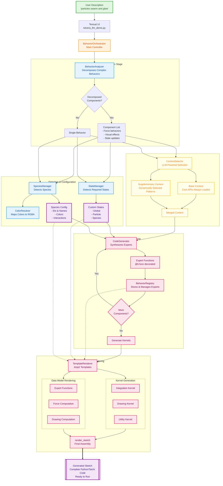

# Tölvera LLM Engine: Visual Architecture Guide

This document provides architectural diagrams for the Tölvera LLM code generation engine. These diagrams illustrate how the system transforms natural language descriptions into executable particle simulations through a multi-stage pipeline. The engine leverages language models with intelligent context selection to generate optimized Taichi GPU kernels for complex particle behaviors.

## Main Workflow: Natural Language to Code Pipeline

This diagram illustrates the complete synthesis pipeline from natural language input to executable code output. The flow demonstrates how each component processes and transforms data through the system.

## Context Selection Architecture

This diagram details the intelligent context selection mechanism. The system employs a two-tier approach where base contexts are always loaded while supplementary contexts are dynamically selected based on behavior requirements, optimizing token usage and generation quality.

## Architecture Components

### Analysis Phase

The BehaviorOrchestrator receives natural language descriptions through the Textual UI and coordinates the synthesis pipeline. Complex behaviors are decomposed by the BehaviorAnalyzer into implementable components including force behaviors, visual effects, and state updates.

### Detection and Configuration

The StateManager analyzes requirements to detect and create necessary custom states (global, particle, or species-level). Concurrently, the SpeciesManager identifies species mentions, extracts relationships, and configures multi-agent interactions. The ColorResolver maps semantic color descriptions to RGBA values for visual consistency.

### Context Selection

The ContextSelector employs a two-tier approach to documentation loading. Base contexts containing core APIs are always included, while supplementary contexts are dynamically selected using LLM analysis based on the specific behavior requirements. This optimization reduces token usage while maintaining generation quality.

### Code Generation

The CodeGenerator synthesizes Taichi expert functions using the merged context and detected configurations. Each generated expert is registered in the BehaviorRegistry, which tracks types, weights, and species associations. The synthesis loop continues until all decomposed components are processed.

### Template Rendering

The TemplateRenderer provides comprehensive code generation through multiple specialized methods:

- **Kernel Generation**: `render_integration_kernel`, `render_utility_kernel`, and `render_drawing_kernel` generate the main execution kernels from registered experts
- **Data Model Conversion**: `render_expert_function` transforms structured data models into Taichi code, delegating to `render_force_computation` for physics and `render_drawing_computation` for visual effects
- **Sketch Assembly**: `render_sketch` combines all generated components (kernels, experts, initialization, states) into a complete executable Python file with proper update call ordering and particle rendering logic

The renderer includes code cleaning utilities to ensure syntactically valid output and uses Jinja2 templates located in the `templates/` directory for consistent code structure.

## Development Notes

These diagrams represent the architecture as implemented for the Google Summer of Code 2025 final submission. The modular design facilitates extension through:

- Adding new behavior patterns to the context library
- Implementing additional LLM providers in the factory pattern
- Extending the template system with new kernel types
- Creating custom decomposition strategies for novel behavior categories

The system maintains clear separation of concerns with each component responsible for a specific aspect of the synthesis pipeline. Refer to the README.md files in each subdirectory for detailed implementation notes and extension guidelines.
